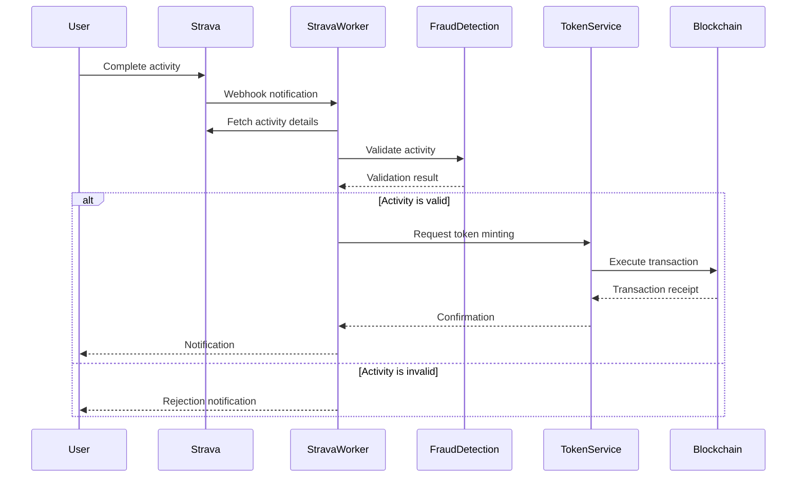

# Data Flows

## Activity Processing Flow

## Resilience Strategies

1. **Circuit Breakers**
   - Implemented on external API calls (Strava, Blockchain)
   - Fallback to cached data when possible

2. **Retry Mechanisms**
   - Exponential backoff for failed API calls
   - Dead letter queues for failed processing

3. **Rate Limiting**
   - Protect APIs from abuse
   - Respect third-party API limits